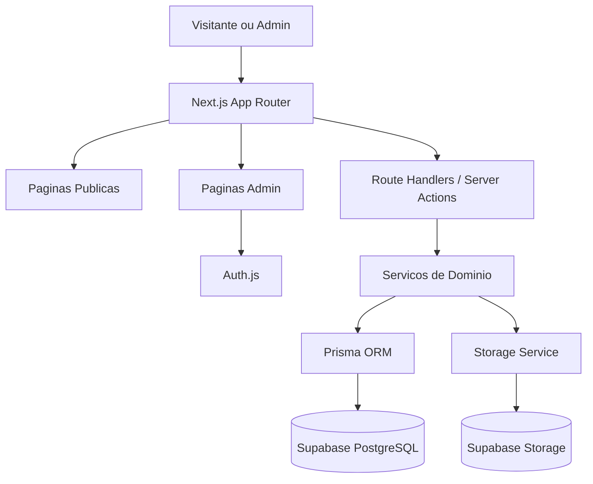
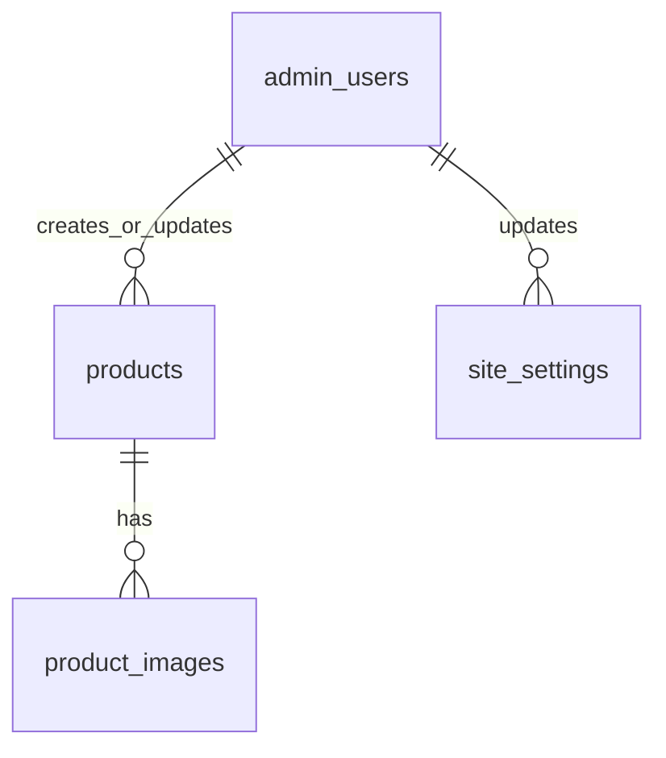

# AgroMassa - Design Tecnico

**Idea**: `specs/01-ideia.md`
**Spec**: `specs/02-spec.md`
**Status**: Concluido
**Fase**: Design

---

## Visao do Design

O projeto sera tratado como greenfield. Hoje o repositorio contem apenas artefatos de especificacao e a logo `agromassa.jpeg`, sem aplicacao existente para reaproveitar. O design abaixo define uma implementacao enxuta para o MVP, priorizando:

- simplicidade operacional
- boa experiencia mobile
- painel administrativo proprio
- persistencia em banco de dados
- upload de imagens com armazenamento externo
- busca com suporte a ignorar acentos e caixa
- baixo acoplamento entre UI, regras de negocio e persistencia

---

## Stack Recomendada para o MVP

| Camada | Escolha recomendada | Motivo |
| --- | --- | --- |
| Frontend e BFF | Next.js com App Router + TypeScript | Permite paginas publicas, painel admin, Route Handlers e Server Actions em um unico projeto. |
| UI | React + Tailwind CSS + componentes locais | Rapidez de entrega, consistencia visual e baixo custo de manutencao. |
| Validacao | Zod | Mesma regra de validacao no servidor e em formularios. |
| Banco de dados | Supabase PostgreSQL | Mantem PostgreSQL gerenciado, simplifica operacao inicial e continua compativel com Prisma. |
| ORM | Prisma ORM | Tipagem forte, migracoes e camada de acesso clara para MVP. |
| Autenticacao | Auth.js com Credentials Provider + sessao JWT em cookie HttpOnly | Adequado para um unico administrador com painel proprio e sem multiusuario complexo. |
| Hash de senha | bcrypt | Escolha pragmatica para MVP com bom suporte no ecossistema Node. |
| Upload de imagens | Route Handler autenticado + cliente Supabase Storage | Fluxo simples para ate 8 fotos por produto. |
| Storage de imagens | Supabase Storage | Integracao direta com o banco escolhido e bom encaixe para binarios do MVP. |
| Imagens | Validacao e armazenamento do arquivo original com nome interno seguro | Evita colisoes, melhora seguranca e mantem o MVP simples. |
| Deploy | Vercel | Boa integracao com Next.js App Router e deploy simples para o MVP. |

### Justificativa resumida

- Next.js cobre rotas publicas, admin e backend HTTP no mesmo repositorio.
- Prisma acelera a camada de dados sem exigir SQL cru em todo o projeto.
- PostgreSQL atende bem o requisito de busca e filtros, inclusive com `unaccent` e `pg_trgm` se precisarmos indexar texto normalizado.
- Auth.js com credenciais e sessao JWT e suficiente para um MVP com apenas 1 administrador.
- Supabase PostgreSQL e Supabase Storage mantem a infra inicial enxuta sem mudar as escolhas principais do design.
- Vercel combina bem com Next.js e reduz atrito operacional no MVP.

---

## Arquitetura Geral do Sistema

### Resumo

Arquitetura monolitica modular:

- uma unica aplicacao Next.js
- rotas publicas renderizadas para SEO e navegacao rapida
- area administrativa protegida por autenticacao
- camada de acesso a dados separada da UI
- banco relacional Supabase PostgreSQL para dados estruturados
- Supabase Storage para imagens



### Camadas logicas

| Camada | Responsabilidade |
| --- | --- |
| `app/` | Rotas, layouts, paginas, handlers HTTP e a composicao principal da UI. |
| `src/features/` | Regras por dominio: produtos, institucional, autenticacao. |
| `src/lib/` | Cliente Prisma, auth config, utilitarios, normalizacao de busca. |
| `src/components/` | Componentes visuais reutilizaveis. |
| `src/validators/` | Schemas Zod para draft, publicacao, login e filtros. |
| `prisma/` | Schema, migracoes e seeds. |

### Padrao de interacao

1. A UI publica ou admin dispara navegacao, formulario ou acao.
2. A regra entra por Server Action ou Route Handler.
3. O schema Zod valida entrada.
4. O servico de dominio aplica regras de negocio.
5. Prisma persiste os dados no PostgreSQL.
6. Uploads vao para object storage e apenas metadados ficam no banco.

---

## Analise de Reuso

### Reuso existente

Nao ha codigo de aplicacao no repositorio para reaproveitar.

### Artefatos existentes que influenciam o design

| Artefato | Uso no design |
| --- | --- |
| `specs/01-ideia.md` | Fonte de escopo original. |
| `specs/02-spec.md` | Fonte funcional consolidada. |
| `agromassa.jpeg` | Referencia de identidade visual, paleta e linguagem da interface. |

### Conclusao

O projeto deve nascer com estrutura clara de dominio, para evitar que o MVP fique dependente de logica espalhada em paginas e componentes.

---

## Estrutura de Pastas

Estrutura sugerida:

```text
/
|-- app/
|   |-- (public)/
|   |   |-- page.tsx
|   |   |-- produtos/
|   |   |   |-- page.tsx
|   |   |   |-- [slug]/
|   |   |   |   |-- page.tsx
|   |-- admin/
|   |   |-- login/
|   |   |   |-- page.tsx
|   |   |-- page.tsx
|   |   |-- produtos/
|   |   |   |-- page.tsx
|   |   |   |-- novo/
|   |   |   |   |-- page.tsx
|   |   |   |-- [id]/
|   |   |   |   |-- page.tsx
|   |   |-- institucional/
|   |   |   |-- page.tsx
|   |-- api/
|   |   |-- auth/
|   |   |   |-- [...nextauth]/
|   |   |   |   |-- route.ts
|   |   |-- admin/
|   |   |   |-- produtos/
|   |   |   |   |-- route.ts
|   |   |   |   |-- [id]/
|   |   |   |   |   |-- route.ts
|   |   |   |-- uploads/
|   |   |   |   |-- route.ts
|   |-- layout.tsx
|   |-- globals.css
|-- src/
|   |-- components/
|   |   |-- public/
|   |   |-- admin/
|   |   |-- shared/
|   |-- features/
|   |   |-- auth/
|   |   |-- institutional/
|   |   |-- products/
|   |-- lib/
|   |   |-- auth/
|   |   |-- db/
|   |   |-- storage/
|   |   |-- search/
|   |   |-- utils/
|   |-- validators/
|   |-- types/
|-- prisma/
|   |-- schema.prisma
|   |-- migrations/
|   |-- seed.ts
|-- public/
|   |-- brand/
|   |   |-- agromassa.jpeg
|-- specs/
```

### Observacoes

- `app/(public)` separa a navegacao aberta da area autenticada.
- `src/features` concentra casos de uso.
- `api/admin/uploads` fica protegido e isolado de outros endpoints.

---

## Rotas Publicas

| Rota | Tipo | Objetivo |
| --- | --- | --- |
| `/` | Pagina | Home institucional da AgroMassa. |
| `/produtos` | Pagina | Catalogo publico com busca, filtros e ordenacao padrao. |
| `/produtos/[slug]` | Pagina | Detalhes do produto com galeria e CTA de WhatsApp. |

### Parametros de consulta em `/produtos`

| Parametro | Exemplo | Uso |
| --- | --- | --- |
| `q` | `trator john deere` | Busca textual normalizada. |
| `categoria` | `tratores` | Filtro por categoria. |
| `condicao` | `usado` | Filtro por condicao. |
| `marca` | `john-deere` | Filtro por marca. |
| `status` | `disponivel` | Filtro por status. |
| `page` | `2` | Incremento do carregamento progressivo via botao "Carregar mais". |

### Comportamento

- ordenacao fixa no MVP: destaque primeiro, depois mais recentes
- filtros combinaveis
- resultado vazio com mensagem explicita
- produtos em rascunho ou invisiveis nunca aparecem
- o catalogo usa botao "Carregar mais"
- o detalhe do produto acontece apenas em pagina dedicada `/produtos/[slug]`

---

## Rotas Administrativas

| Rota | Tipo | Protegida | Objetivo |
| --- | --- | --- | --- |
| `/admin/login` | Pagina | Nao | Tela de login do administrador. |
| `/admin` | Pagina | Sim | Dashboard resumido. |
| `/admin/produtos` | Pagina | Sim | Lista de produtos com busca e filtros internos. |
| `/admin/produtos/novo` | Pagina | Sim | Cadastro de novo produto. |
| `/admin/produtos/[id]` | Pagina | Sim | Edicao de produto existente. |
| `/admin/institucional` | Pagina | Sim | Edicao de informacoes publicas da empresa. |

### Endpoints internos sugeridos

| Endpoint | Metodo | Objetivo |
| --- | --- | --- |
| `/api/auth/[...nextauth]` | `GET/POST` | Fluxo de autenticacao Auth.js. |
| `/api/admin/produtos` | `POST` | Criar produto draft ou publicado. |
| `/api/admin/produtos/[id]` | `GET` | Obter produto para edicao. |
| `/api/admin/produtos/[id]` | `PATCH` | Atualizar produto. |
| `/api/admin/uploads` | `POST` | Receber e processar imagem autenticada. |

---

## Modelo de Banco de Dados

### Visao geral

O banco do MVP pode ser mantido com 4 tabelas principais:

1. `admin_users`
2. `site_settings`
3. `products`
4. `product_images`

Enums logicos podem existir na aplicacao e no banco para status, categoria e condicao.

### Entidades e relacionamentos



Observacao:
`site_settings` pode ter apenas uma linha ativa no MVP, mas ainda vale como tabela para manter historico simples de alteracao futura.

---

## Tabelas Necessarias

### 1. `admin_users`

Responsabilidade: armazenar o unico administrador do MVP e permitir futura expansao controlada.

| Campo | Tipo sugerido | Regras |
| --- | --- | --- |
| `id` | `uuid` | PK |
| `name` | `varchar(120)` | obrigatorio |
| `email` | `varchar(190)` | obrigatorio, unico |
| `password_hash` | `varchar(255)` | obrigatorio |
| `is_active` | `boolean` | default `true` |
| `last_login_at` | `timestamp` | opcional |
| `created_at` | `timestamp` | obrigatorio |
| `updated_at` | `timestamp` | obrigatorio |

### 2. `site_settings`

Responsabilidade: armazenar informacoes institucionais publicas.

| Campo | Tipo sugerido | Regras |
| --- | --- | --- |
| `id` | `uuid` | PK |
| `company_name` | `varchar(160)` | obrigatorio |
| `logo_path` | `varchar(255)` | obrigatorio |
| `institutional_text` | `text` | obrigatorio |
| `services_text` | `text` | obrigatorio |
| `phone_display` | `varchar(40)` | obrigatorio |
| `whatsapp_display` | `varchar(40)` | obrigatorio |
| `whatsapp_digits` | `varchar(20)` | obrigatorio |
| `city` | `varchar(120)` | obrigatorio |
| `state` | `varchar(2)` | obrigatorio |
| `updated_by_admin_id` | `uuid` | FK para `admin_users.id` |
| `created_at` | `timestamp` | obrigatorio |
| `updated_at` | `timestamp` | obrigatorio |

### 3. `products`

Responsabilidade: cadastro central de produtos do catalogo.

| Campo | Tipo sugerido | Regras |
| --- | --- | --- |
| `id` | `uuid` | PK |
| `slug` | `varchar(220)` | unico, usado na rota publica |
| `name` | `varchar(180)` | obrigatorio para publicacao |
| `category` | `varchar(40)` | obrigatorio, ex.: `tratores`, `implementos` |
| `subcategory` | `varchar(80)` | obrigatorio para publicacao |
| `brand` | `varchar(120)` | obrigatorio para publicacao |
| `model` | `varchar(120)` | obrigatorio para publicacao |
| `year` | `integer` | opcional |
| `condition` | `varchar(20)` | obrigatorio, ex.: `novo`, `usado`, `seminovo` |
| `description` | `text` | obrigatorio para publicacao |
| `technical_specs` | `text` | obrigatorio para publicacao |
| `price_cents` | `integer` | opcional |
| `price_visible` | `boolean` | default `true` |
| `status` | `varchar(20)` | obrigatorio, ex.: `disponivel`, `vendido`, `sob_consulta`, `alugado`, `rascunho` |
| `city` | `varchar(120)` | obrigatorio para publicacao |
| `state` | `varchar(2)` | obrigatorio para publicacao |
| `is_featured` | `boolean` | default `false` |
| `is_public_visible` | `boolean` | default `false` |
| `is_archived` | `boolean` | default `false` |
| `main_image_id` | `uuid` | FK opcional para `product_images.id`; obrigatorio para publicacao |
| `search_text_normalized` | `text` | campo derivado para busca |
| `created_by_admin_id` | `uuid` | FK para `admin_users.id` |
| `updated_by_admin_id` | `uuid` | FK para `admin_users.id` |
| `published_at` | `timestamp` | opcional |
| `created_at` | `timestamp` | obrigatorio |
| `updated_at` | `timestamp` | obrigatorio |

### 4. `product_images`

Responsabilidade: armazenar metadados das imagens de cada produto.

| Campo | Tipo sugerido | Regras |
| --- | --- | --- |
| `id` | `uuid` | PK |
| `product_id` | `uuid` | FK para `products.id` |
| `storage_key` | `varchar(255)` | obrigatorio, unico |
| `public_url` | `varchar(500)` | obrigatorio |
| `original_filename` | `varchar(255)` | obrigatorio |
| `mime_type` | `varchar(80)` | obrigatorio |
| `file_size_bytes` | `integer` | obrigatorio |
| `width` | `integer` | opcional |
| `height` | `integer` | opcional |
| `sort_order` | `integer` | default `0` |
| `is_main` | `boolean` | default `false` |
| `created_at` | `timestamp` | obrigatorio |

---

## Relacionamentos

| Origem | Destino | Tipo | Regra |
| --- | --- | --- | --- |
| `admin_users` | `products.created_by_admin_id` | 1:N | um admin cria varios produtos |
| `admin_users` | `products.updated_by_admin_id` | 1:N | um admin atualiza varios produtos |
| `admin_users` | `site_settings.updated_by_admin_id` | 1:N | um admin pode atualizar configuracoes |
| `products` | `product_images.product_id` | 1:N | um produto tem de 0 a 8 imagens |
| `products` | `product_images.id` via `main_image_id` | 1:1 logico | define a imagem principal |

### Regra de integridade

- `main_image_id`, quando preenchido, deve apontar para uma imagem do proprio produto
- um produto publicado deve ter exatamente 1 imagem principal
- um produto pode existir sem imagem apenas enquanto estiver em rascunho

---

## Autenticacao do Administrador

### Estrategia

Usar Auth.js com Credentials Provider e sessao JWT armazenada em cookie HttpOnly.

### Motivos

- existe apenas 1 administrador no MVP
- nao ha necessidade de OAuth, magic link ou painel de usuarios
- reduz a quantidade de tabelas e fluxo de sessao no banco

### Fluxo

1. Admin acessa `/admin/login`.
2. Envia `email + password`.
3. Auth.js valida credenciais.
4. Senha e comparada com `password_hash` usando bcrypt.
5. Em caso de sucesso, um JWT de sessao e emitido em cookie seguro.
6. Middleware protege todas as rotas `/admin/*`, exceto `/admin/login`.

### Regras

- apenas contas `is_active = true` podem autenticar
- sem recuperacao de senha no MVP
- logout invalida a sessao no cliente
- para mudanca futura para mais administradores, a tabela `admin_users` ja suporta expansao
- o unico administrador inicial sera criado por seed com variaveis de ambiente

### Dados mantidos

- `last_login_at` atualizado a cada login valido
- senha nunca trafega nem e registrada em log

---

## Fluxo de Upload de Imagens

### Fluxo recomendado

1. Admin autenticado abre tela de produto.
2. Seleciona uma ou mais imagens.
3. Frontend envia arquivo para `/api/admin/uploads`.
4. Backend valida sessao, quantidade, tipo, tamanho e nome.
5. Backend gera nome interno seguro e sobe o arquivo para object storage.
6. Backend grava metadados em `product_images`.
7. Ao salvar o produto, a imagem principal e associada via `main_image_id`.

### Validacoes do upload

- apenas admin autenticado pode enviar
- formatos aceitos no MVP: `image/jpeg`, `image/png`, `image/webp`
- rejeitar arquivo vazio
- limite de 5 MB por imagem
- limite de 8 imagens por produto
- rejeitar extensoes e nomes inseguros
- gerar nome interno independente do nome enviado
- validar `mime type` e extensao

### Processamento do MVP

- gerar chave de storage por UUID
- validar e armazenar o arquivo original
- nao gerar automaticamente versoes `webp` nem derivadas otimizadas no MVP

### Decisao de simplicidade

Para o MVP, o upload sera mediado pelo servidor da aplicacao em Vercel e persistido no Supabase Storage. Se houver restricao pratica de payload em runtime, a fase Tasks pode migrar esse fluxo para upload assinado sem mudar o modelo de dados.

---

## Armazenamento das Fotos dos Produtos

### Estrategia

- binarios fora do banco
- metadados no banco
- bucket no Supabase Storage
- leitura controlada por estrategia definida na implementacao, preferencialmente publica apenas para imagens efetivamente usadas no catalogo

### Estrutura logica de chaves

```text
products/
  {productId}/
    {imageId}-main.jpg
    {imageId}-gallery-01.png
```

### Regras

- nao usar nome original como chave final
- salvar URL final ou caminho resolvivel em `public_url`
- manter `storage_key` para exclusao, reprocessamento e troca de provedor
- preservar o formato original validado do arquivo no MVP

### Motivo

Isso reduz tamanho do banco e simplifica cache, CDN e entrega de imagens.

---

## Busca e Filtros

### Campos consultados pela busca textual

- `name`
- `brand`
- `model`
- `description`

### Estrategia tecnica

Usar um campo derivado `search_text_normalized` no produto, preenchido no salvamento com a concatenacao normalizada de:

- nome
- marca
- modelo
- descricao

### Normalizacao

- converter para minusculas
- remover acentos
- remover espacos duplicados

### Implementacao recomendada

No MVP, a normalizacao pode ser feita na aplicacao ao salvar o produto e tambem na string de busca antes da consulta. No PostgreSQL, recomendamos habilitar `unaccent` para remocao de acentos e `pg_trgm` para indexacao mais eficiente caso o catalogo cresca.

### Filtros

Filtros publicos obrigatorios:

- categoria
- condicao
- marca
- status

### Estrategia SQL

- clausulas `WHERE` condicionais por filtro
- busca textual sobre `search_text_normalized`
- resultados sempre restritos pelas regras de visibilidade publica
- carregamento progressivo com limite por pagina e `page` incremental para suportar o botao "Carregar mais"

### Indexes recomendados

- indice por `category`
- indice por `condition`
- indice por `brand`
- indice por `status`
- indice composto por `is_public_visible`, `is_archived`, `is_featured`, `created_at`
- indice de texto em `search_text_normalized` com `pg_trgm` se necessario

---

## Ordenacao dos Produtos

### Regra funcional

1. produtos em destaque primeiro
2. dentro de cada grupo, produtos mais recentes primeiro

### Estrategia tecnica

Ordenacao SQL padrao:

```text
ORDER BY is_featured DESC, created_at DESC
```

### Desempate

Se necessario:

```text
ORDER BY is_featured DESC, created_at DESC, id DESC
```

### Observacao

Nao ha necessidade de campo manual de ordenacao no MVP. O catalogo usara botao "Carregar mais" sobre essa mesma ordenacao.

---

## Integracao com WhatsApp

### Estrategia

Gerar link dinamico para WhatsApp Web / app com o numero padronizado e a mensagem definida em spec.

### Formato tecnico

- numero exibido ao usuario: `17 99727-8876`
- numero tecnico no link: `5517997278876`

### Template de mensagem

`Ola, tenho interesse no produto [NOME DO PRODUTO] anunciado no site AgroMassa. Pode me passar mais informacoes?`

### Geracao do link

```text
https://wa.me/5517997278876?text={mensagem-url-encoded}
```

### Ponto de uso

- botao na home institucional
- botao no card do produto
- botao na pagina de detalhes

### Regra

O texto deve ser montado no servidor ou em utilitario comum para evitar divergencia entre catalogo e detalhe.

---

## Regras de Visibilidade Publica

Um produto so pode aparecer no site publico quando todas as condicoes abaixo forem verdadeiras:

- `is_archived = false`
- `is_public_visible = true`
- `status != 'rascunho'`
- `main_image_id` preenchido
- campos obrigatorios de publicacao preenchidos

### Produtos vendidos

- podem continuar publicos
- devem exibir status visual claro
- permanencia publica depende de `is_public_visible`

### Produtos alugados

- podem continuar publicos
- devem exibir status visual claro
- o status comunica indisponibilidade temporaria ou vocacao para locacao

### Produtos sob consulta

- podem aparecer normalmente
- o preco pode estar vazio, desde que o status e o CTA estejam corretos

---

## Validacoes do Cadastro de Produto

### Validacoes para salvar rascunho

Obrigatorias apenas:

- `status`
- algum identificador minimo para organizacao interna, preferencialmente `name`

Observacao:
mesmo para rascunho, e recomendavel exigir ao menos `name` para facilitar gestao. Esta e uma decisao tecnica assumida para evitar rascunhos anonimos.

### Validacoes para publicar

Campos obrigatorios:

- `name`
- `category`
- `subcategory`
- `brand`
- `model`
- `condition`
- `description`
- `technical_specs`
- `status` diferente de `rascunho`
- `city`
- `state`
- `main_image_id`
- pelo menos 1 imagem vinculada

### Validacoes adicionais

- `year`, quando informado, deve estar em faixa plausivel
- `price_cents`, quando informado, deve ser maior que zero
- `state` deve ter 2 caracteres
- no maximo 8 imagens
- `slug` deve ser unico
- apenas 1 imagem principal por produto
- imagem deve ter ate 5 MB
- formatos aceitos: JPG, PNG e WEBP

### Validacao institucional

`site_settings` deve exigir:

- nome da empresa
- texto institucional
- telefone
- WhatsApp
- cidade
- estado

---

## Estrategia de Responsividade

### Principios

- mobile-first
- pagina publica otimizada para consulta rapida
- painel admin funcional em celular, mas prioritariamente confortavel em tablet e desktop

### Catalogo publico

- cards em 1 coluna no mobile
- 2 colunas em tablet
- 3 ou 4 colunas em desktop, conforme largura
- filtros como drawer no mobile e barra lateral ou barra superior no desktop

### Detalhe do produto

- galeria no topo no mobile
- galeria ao lado das informacoes no desktop
- CTA de WhatsApp sempre visivel sem competir com o conteudo

### Painel administrativo

- formulario em coluna unica no mobile
- agrupamento por secoes no desktop
- upload com preview e ordenacao visual clara
- tabela/lista admin com fallback para cards em telas menores

### Performance

- imagens responsivas
- pagina publica cacheavel quando possivel
- admin sempre dinamico
- botao "Carregar mais" para manter o catalogo leve em mobile e desktop

---

## Estrategia Visual Baseada na Logo `agromassa.jpeg`

### Leitura da marca

A logo combina:

- verde agricola vivo
- verde escuro profundo
- preto forte
- branco de alto contraste
- composicao em selo circular com trator central
- tipografia robusta, condensada e de impacto

### Direcao visual recomendada

- linguagem robusta e comercial, nao editorial
- alto contraste
- blocos escuros com acentos verdes para CTA e status
- uso de branco para respiracao e legibilidade
- textura ou fotografia discreta relacionada a maquinas e campo, sem poluir o catalogo

### Paleta base sugerida

| Papel | Cor sugerida |
| --- | --- |
| Primaria escura | `#0D3B12` |
| Primaria viva | `#39B31A` |
| Fundo escuro | `#111111` |
| Fundo claro | `#F5F7F4` |
| Texto forte | `#111111` |
| Texto sobre escuro | `#FFFFFF` |
| Borda neutra | `#D7DDD4` |

### Tipografia recomendada

- titulos: fonte condensada e forte, como `Barlow Condensed`, `Archivo Narrow` ou equivalente
- corpo: fonte limpa de alta legibilidade, como `Public Sans` ou `Source Sans 3`

### Aplicacao visual

- home com hero focado em marca, trator e servicos
- cards de produto com foto dominante e informacoes objetivas
- selo visual de status em verde, cinza ou preto conforme contexto
- botoes de WhatsApp com verde vivo e contraste alto
- admin mais utilitario, mas mantendo a mesma paleta e peso visual

### O que evitar

- visual generico de marketplace roxo
- excesso de sombras suaves e cartoes arredondados demais
- composicoes que enfraquecam a percepcao de maquina robusta e negocio serio

---

## Seguranca Basica

### Aplicacao

- cookies de sessao `HttpOnly`, `Secure` em producao e `SameSite=Lax`
- middleware protegendo todas as rotas administrativas
- validacao server-side com Zod em toda escrita
- sanitizacao basica de strings antes de persistir
- mensagens de erro sem vazar detalhes internos
- variaveis de ambiente protegidas na Vercel e no pipeline local

### Senha e autenticacao

- senha armazenada apenas em hash bcrypt
- limitar tentativas de login por IP ou por janela de tempo
- logout removendo sessao ativa do navegador

### Upload

- allowlist de `mime types`
- renomear arquivo no servidor
- bloquear extensoes nao permitidas
- limitar quantidade e tamanho
- armazenar fora da arvore publica executavel da aplicacao
- validar tamanho maximo de 5 MB por imagem

### Banco e API

- usar variaveis de ambiente para segredos
- nao expor endpoints administrativos sem sessao valida
- aplicar autorizacao no servidor, nao apenas na UI
- soft delete por arquivamento, sem apagar registros de forma acidental

---

## Riscos Tecnicos

| Risco | Impacto | Mitigacao |
| --- | --- | --- |
| Upload mediado pelo servidor na Vercel | pode sofrer com limites de payload ou tempo de execucao | manter possibilidade de migracao para upload assinado no Supabase Storage |
| Busca com acento e filtros em catalogo crescente | pode degradar sem indexacao | usar `search_text_normalized` e considerar `pg_trgm` |
| Apenas 1 admin sem recuperacao de senha | risco operacional de acesso | seed e rotina segura de troca manual de senha |
| Fotos de 5 MB no formato original | piora desempenho e custo se mal usadas | limitar tamanho, usar componentes responsivos e evoluir para otimizacao futura |
| Sessao JWT em credenciais | revogacao imediata e mais simples no cliente do que no servidor | expiracao curta e renovacao controlada |

---

## Decisoes Tecnicas Assumidas

As decisoes abaixo foram assumidas neste design por falta de definicao contraria na spec:

- usar Next.js como aplicacao unica para frontend publico, admin e backend HTTP
- usar Supabase PostgreSQL como banco principal
- usar Prisma como ORM
- usar Auth.js com credenciais e sessao JWT
- usar Supabase Storage para imagens
- exigir pelo menos `name` para salvar rascunho, por ergonomia administrativa
- manter `site_settings` como tabela unica em vez de arquivo ou constantes
- manter filtros e busca no proprio banco, sem mecanismo de busca externo
- usar soft delete por `is_archived`
- hospedar a aplicacao na Vercel
- criar o admin inicial via seed com variaveis de ambiente
- usar botao "Carregar mais" no catalogo
- usar apenas pagina dedicada em `/produtos/[slug]` para detalhe do produto
- modal de detalhe fica fora do MVP

---

## Decisoes tecnicas finais

- Hospedagem: Vercel.
- Banco de dados: Supabase PostgreSQL.
- Storage de imagens: Supabase Storage.
- Limite por imagem no MVP: 5 MB.
- Formatos permitidos: JPG, PNG e WEBP.
- O upload no MVP apenas valida e armazena o arquivo original.
- Geracao automatica de WEBP e versoes otimizadas fica fora do MVP.
- O administrador inicial sera criado por seed usando variaveis de ambiente.
- O catalogo publico usara botao "Carregar mais".
- O detalhe do produto sera pagina dedicada em `/produtos/[slug]`.
- Modal de detalhe a partir do catalogo fica fora do MVP.

---

## Notas de Implementacao para a Fase Tasks

- Criar primeiro a base de dominio: schema Prisma, enums, seeds e auth bootstrap.
- Implementar rotas publicas lendo apenas produtos visiveis.
- Implementar painel admin antes de refinamentos visuais avancados.
- Subir fluxo de upload junto com regras de validacao de publicacao.
- Tratar o catalogo publico como principal fluxo de negocio do MVP.

---

## Duvidas Tecnicas Pendentes Antes da Fase Tasks

Todas as duvidas tecnicas registradas na versao anterior foram resolvidas nesta fase de Design.

- Hospedagem definida: Vercel.
- Banco definido: Supabase PostgreSQL.
- Storage definido: Supabase Storage.
- Upload definido: ate 5 MB por imagem, formatos JPG, PNG e WEBP, com armazenamento do original.
- Bootstrap do administrador definido: seed inicial com variaveis de ambiente.
- Navegacao do catalogo definida: botao "Carregar mais".
- Navegacao de detalhe definida: pagina dedicada em `/produtos/[slug]`.
- Modal de detalhes removido do MVP.
